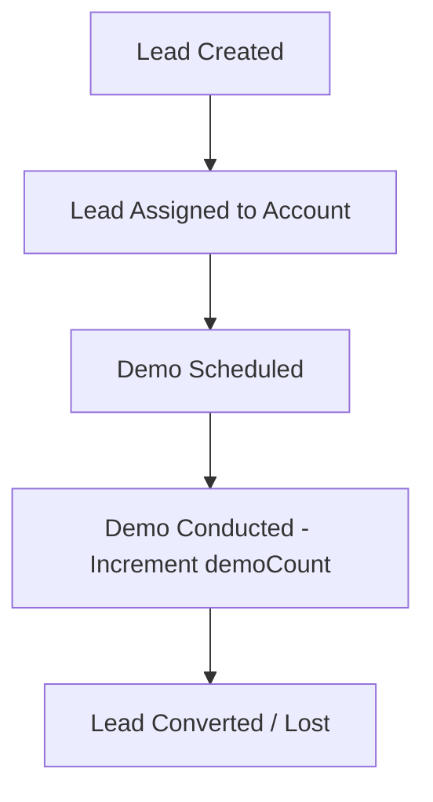

# Data Flow

## Key Data Pipelines

### 1. Lead Journey

### 2. Task Completion Workflow
- **Creation**: Manager creates a task in a project step.
- **In Progress**: Developer moves task to `IN_PROGRESS` and starts a `TaskTimeEntry`.
- **In Review**: Task status changed to `IN_REVIEW`.
- **Completion**: Manager reviews task, approves it, setting status to `COMPLETED`.

### 3. Monthly Payroll Workflow
- **Trigger**: Cron job triggers on the 1st of the month or admin runs manual build.
- **Calculations**: Read monthly attendance logs for the employee. Subtract unpaid leaves from base salary.
- **Approval**: Generate salary statements in `GENERATED` status.
- **Notice**: Admin triggers credit notice, updating status to `CREDITED` and alerting the user.
