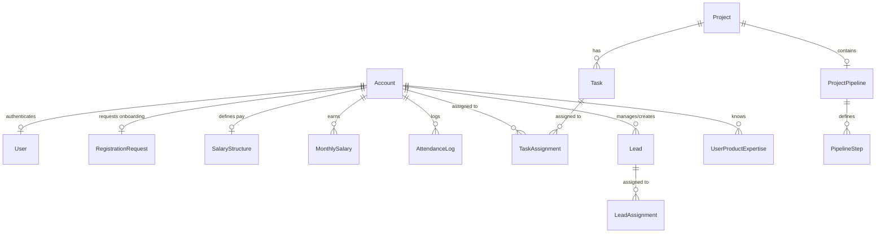

# Domain Model

## Entity Relationship Overview
The system domain consists of multiple inter-connected tables mapped via Prisma ORM:

## Description of Entities
- **Account**: Main employee record storing designations and personal details.
- **User**: Authentication details including username and hashed password.
- **Task**: Action item. If `isLearning` is true, it marks a developer training task.
- **Lead**: Store details about sales prospects, including `demoCount` and status.
- **UserProductExpertise**: Intersection table mapping an account to a product and expertise levels (`BEGINNER`, `INTERMEDIATE`, `EXPERT`).
