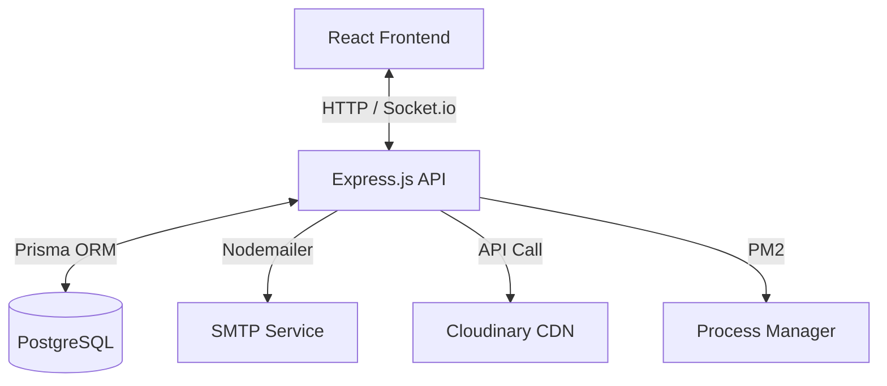

# Project Overview

## Summary
**Team Shivansh** is a comprehensive Enterprise Resource Planning (ERP) and Team Management System. It serves as an internal operations dashboard designed to manage employee lifecycle, daily attendance, payroll calculations, project pipelines, client lead tracking, and internal communications.

## Vision & Goals
- **Operational Efficiency**: Automate HR administrative overhead (salary slips, leave tracking, check-ins).
- **Transparency**: Give employees clear visibility over their tasks, feedback, DSU submissions, and payroll notices.
- **Productivity**: Empower managers with kanban project pipelines, time logging, and employee activity audits.
- **Lead Tracking**: Centralize lead assignments, demo schedules, and sales performance logs.

## Core Workflows
1. **User Registration & Onboarding**:
   - Accounts submit a `RegistrationRequest` which is approved or rejected by an admin.
   - Upon approval, the account status becomes active and access credentials are generated.
2. **Attendance & Activity Logs**:
   - Employees log in daily, clocking their attendance status (`PRESENT`, `HALF_DAY`, `ABSENT`).
   - Active status toggles (`isBusy`, `isAvailable`) log events in the `BusyActivityLog`.
3. **Task & Pipeline Lifecycle**:
   - Projects are created with customizable columns/steps.
   - Tasks (including `isLearning` journey tasks) are assigned to members.
   - Time tracking logs work sessions via `TaskTimeEntry`.
4. **Payroll and Revision Lifecycle**:
   - Admins define `SalaryStructure` for active accounts.
   - Revisions are tracked; monthly salaries are computed automatically based on attendance logs and deductions, producing PDF statements.

## High-Level Architecture

