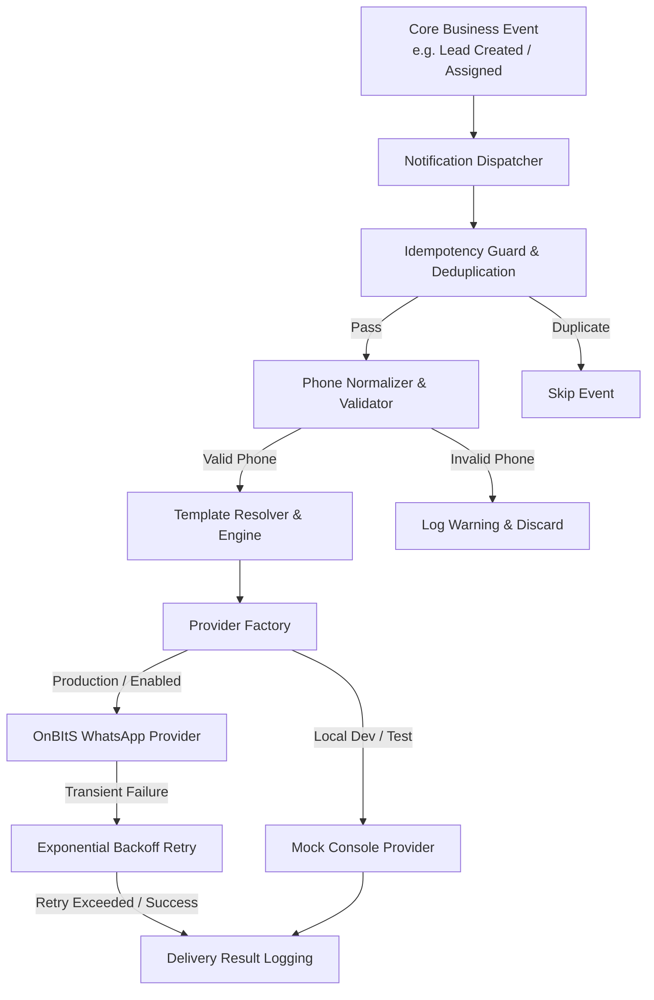

# WhatsApp Integration Architecture with OnBItS

This document describes the automated WhatsApp notification system powered by **OnBItS API** for **Shivansh Infosys**. Phase 1 implements notifications for the **Lead** module, while establishing a future-proof, reusable foundation for upcoming modules (**Quotation**, **Support**, **Customer**, **Project**).

---

## 1. Architecture Overview

The notification system follows an event-driven, decoupled architecture to ensure that external WhatsApp API communication never blocks or causes failures in core business transactions (e.g. Lead creation or assignment).



---

## 2. Directory Structure

All notification components are located under [`src/services/notifications/`](file:///Users/raj/MagicallySoft/team.shivansh-BE/src/services/notifications/):

```
src/services/notifications/
├── index.ts                     # Main entry point & unified exports
├── types/
│   ├── index.ts                 # NotificationModule, NotificationEvent, RecipientType
│   └── provider.interface.ts    # INotificationProvider, SendMessageOptions, Result
├── providers/
│   ├── onbits.provider.ts       # OnBItS REST API client with retry & redaction
│   ├── mock.provider.ts         # In-memory mock provider for testing & dev
│   └── provider.factory.ts      # Active provider resolver (switches via env)
├── templates/
│   ├── template.engine.ts       # Variable parser, validator & safe renderer
│   └── lead.templates.ts        # Lead message templates & portal URL generators
├── utils/
│   ├── phone.util.ts            # E.164 phone normalization & validation
│   ├── idempotency.util.ts      # In-memory deduplication cache
│   └── retry.util.ts            # Exponential backoff retry utility
└── modules/
    └── lead.notification.ts     # Phase 1 Lead event handlers (Created & Assigned)
```

---

## 3. Environment Variables Configuration

Configure the following environment variables in `.env` / server secrets:

| Variable Name | Required | Default Value | Description |
|---|---|---|---|
| `ONBITS_ENABLED` | Optional | `true` (prod) / `false` (dev) | Set `false` to force `MockProvider` without making outbound requests. |
| `ONBITS_API_KEY` | **Required** (Prod) | — | OnBItS account API key (kept strictly on server side). |
| `ONBITS_API_BASE_URL` | Optional | `https://dash.bizzriser.com` | Base URL for OnBItS API endpoints. |
| `ONBITS_PHONE_NUMBER_ID` | Optional | — | Registered WhatsApp Phone Number ID in OnBItS. |
| `ONBITS_APP_ID` | Optional | — | OnBItS App ID identifier. |
| `ONBITS_TIMEOUT_MS` | Optional | `10000` | HTTP request timeout in milliseconds. |
| `CUSTOMER_PORTAL_URL` | Optional | `https://customer.shivanshinfosys.in` | Base URL for customer lead tracking links. |
| `TEAM_PORTAL_URL` | Optional | `https://team.shivanshinfosys.in` | Base URL for team member & admin lead links. |

---

## 4. Phase 1 — Supported Lead Events & Templates

### Event 1: `LEAD_CREATED` (Customer Request Confirmation — Utility Category)
- **Recipient**: Lead Customer
- **Trigger**:
  - `createLeadAdmin` (POST `/leads` by ADMIN or SALES)
  - `createMyLead` (POST `/leads/my` by User)
- **Message Content**:
  ```text
  Hello {{customer_name}},

  Thank you for contacting Shivansh Infosys.
  We have received your request successfully.

  Request Details:
  • Item: {{product_title}}

  Your request has been recorded and assigned to our team.

  Assigned Executive:
  {{member_name}}
  {{member_phone}}

  Our team will contact you regarding your request.

  Regards,
  Shivansh Infosys
  www.shivanshinfosys.in
  ```

### Event 2: `LEAD_ASSIGNED` (Internal Team Member Notification — Utility/Operational)
- **Recipient**: Assigned Team Member(s)
- **Trigger**:
  - `createLeadAdmin` (POST `/leads` by ADMIN or SALES when an assignee is provided)
  - `assignLeadAdmin` (POST `/admin/leads/:id/assign` upon lead reassignment)
  - *(Note: `createMyLead` only dispatches customer notification and does not trigger team member notification)*
- **Message Content**:
  ```text
  New customer request received.
  *{{team_member_name}}* to you.

  Customer Name:
  {{customer_name}}

  Mobile Number:
  {{customer_phone}}

  Product Details:
  {{product_title}}

  Call Priority:
  Urgent

  Lead Details:
  {{remark}}

  Lead Link:
  {{team_member_url}}

  Please review the request and contact the customer accordingly.
  Thank You.
  ```

### Event 3: `ADMIN_PUBLIC_LEAD` (Public Lead Submission Admin Notification — Utility/Operational)
- **Recipient**: All Active Admin Accounts (`Account.User.roles.ADMIN`)
- **Trigger**: `createPublicLead` (POST `/public/leads` via Website, Inquiry Form, YouTube)
- **Message Content**:
  ```text
  New lead received from *{{source}}*.

  Customer Name:
  {{customer_name}}

  Mobile Number:
  {{customer_phone}}

  Product Details:
  {{product_title}}

  Lead Details:
  {{remark}}

  Lead ID:
  {{lead_id}}

  Please review the lead in CRM.
  Thank You.
  ```
- **Campaign Configuration**:
  - `ONBITS_ADMIN_LEAD_CAMPAIGN="New Admin Lead"`
  - Parameters: `source`, `customer_name`, `customer_phone`, `product_title`, `remark`, `lead_id`

---

## 5. Template Variables Reference

| Variable | Description | Example Value |
|---|---|---|
| `{{lead_id}}` | Unique Lead ID | `c7f66a2e-8390-482a-9e12-b9034dc517eb` |
| `{{customer_name}}` | Name of the customer | `John Doe` |
| `{{customer_phone}}` | Customer contact mobile | `9876543210` |
| `{{product_title}}` | Inquiry product / service | `TallyPrime Gold` |
| `{{team_member_name}}` | Name of assigned representative | `Raj Patel` |
| `{{team_member_phone}}` | Contact number of assignee | `919876543210` |
| `{{assigned_by_name}}` | Name of assigner / creator | `Admin / Manager` |
| `{{customer_tracking_url}}`| Customer portal tracking link | `https://customer.shivanshinfosys.in/leads/:id` |
| `{{team_member_url}}` | Team portal direct link | `https://team.shivanshinfosys.in/leads/user/:id` |
| `{{admin_url}}` | Admin portal direct link | `https://team.shivanshinfosys.in/leads/admin/:id` |

---

## 6. Resilience, Security & Error Handling

1. **Non-Blocking Execution**:
   - Notifications are dispatched using `void dispatchLeadCreatedNotification(...)` and `void dispatchLeadAssignedNotification(...)` with comprehensive internal error boundaries.
   - Any WhatsApp failure or timeout **never rolls back lead creation or reassignment**.

2. **Idempotency & Deduplication**:
   - Unique deduplication keys (e.g. `lead:created:${leadId}:${phone}`) prevent multiple duplicate messages if events trigger in quick succession.

3. **Phone Number Normalization & Validation**:
   - Phone numbers are validated and converted into standard E.164 without `+` prefix (e.g. `919876543210`).
   - Invalid numbers are logged and skipped without hitting the external API.

4. **Exponential Backoff Retry**:
   - Retries transient errors (HTTP 429 rate limits, 502/503/504 server errors, network timeouts) with exponential backoff up to 3 attempts.
   - Permanent errors (HTTP 400 bad payload, 401 unauthorized, 404 not found) fail immediately without wasteful retries.

5. **Secret Redaction**:
   - Error messages automatically redact API keys and tokens to prevent leaking credentials in log files.

---

## 7. How to Add Future Modules (Quotation, Support, Customer, Project)

The architecture is designed to support new modules in 3 simple steps:

### Step 1: Add Event & Templates
In [`src/services/notifications/templates/`](file:///Users/raj/MagicallySoft/team.shivansh-BE/src/services/notifications/templates/), create the template file (e.g. `quotation.templates.ts`):
```ts
export const QUOTATION_TEMPLATES = {
  SENT: `*Quotation #{{quotation_number}} Received*\nDear {{customer_name}},\nTotal: ₹{{amount}}\nView: {{quotation_url}}`,
};
```

### Step 2: Create Module Notification Handler
In [`src/services/notifications/modules/`](file:///Users/raj/MagicallySoft/team.shivansh-BE/src/services/notifications/modules/), create `quotation.notification.ts`:
```ts
export async function dispatchQuotationSentNotification(quotationId: string): Promise<void> {
  // Fetch quotation -> Normalize phone -> Render template -> dispatch via getNotificationProvider()
}
```

### Step 3: Trigger in Controller
In the quotation controller, trigger the notification non-blockingly:
```ts
void dispatchQuotationSentNotification(quotation.id);
```
